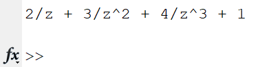
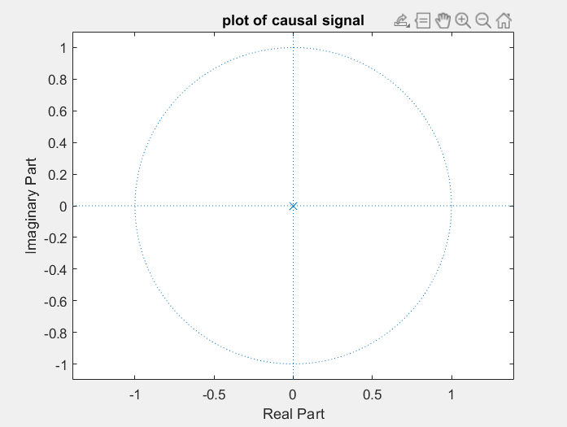

### 5.1 Experiment No: 05
### 5.2 Experiment Name: 
Study of Z-Transformation & Plotting of Zeros-Poles for a Given Causal Signal in Time Domain
### 5.3 Theory:
<div style='text-align: justify;'>
<h4>Causal Signal:</h4>
 A continuous time signal 𝑥(𝑡) is called causal signal if the signal 𝑥(𝑡) = 0 for 𝑡 < 0. Therefore, a causal signal does not exist for negative time. The unit step signal u(t) is an example of causal signal. 

 Similarly, a discrete time sequence x(n) is called the causal sequence if the sequence x(n) = 0 for n < 0.
 <br>
 <h4>Anti-Causal Signal:</h4>
 A continuous-time signal x(t) is called the anti-causal signal if x(t) = 0 for t > 0. Hence, an anti-causal signal does not exist for positive time.

 Similarly, a discrete time sequence x(n) is said to be anti-causal sequence if the sequence x(n) = 0 for 𝑡 > 0.
 <h4>Non-Causal Signal:</h4>
  A signal which is neither causal nor anti-causal is called the non-causal signal. Hence, by the definition, a signal that exists for positive as well as negative time is neither causal nor anti-causal, it is non-causal signal. The sine and cosine signals are examples of non-causal signal
</div>

<br>

### 5.4 Platform: MATLAB
### 5.5 Code:
### 5.5.1 Code for Causal Signal:
```Matlab
clc
x= [1 2 3 4];
syms z
y=0;
for i=1:length(x)
   y = y + x(i)*z^-(i-1);
end
disp(y);
p = poles(y,z);
zplane([],p);
title('plot of causal signal');
```
<br>

### Output:
<p align='center'></p>

*<p align='center'>Figure 5.1: Output of z-transform of causal signal</p>*

<p align='center'></p>

*<p align='center'>Figure 5.2: Plot of zeros-poles for a causal signal</p>*


<br>

### 5.5.2 Code for Anti-Causal Signal:

```Matlab
clc

x= [1 2 3 4];

syms z
y=0;
sz =length(x); 
for i=1:sz
   y = y + x(i)*z^(sz-i);
end

disp(y);

zplane([],[]);
title('plot of anti-causal signal');
```
<br>

### Output:

<p align='center'></p>

*<p align='center'>Figure 5.3: Output of z-transform of anti-causal signal</p>*


<p align='center'></p>

*<p align='center'>Figure 5.4: Plot of zeros-poles for a anti-causal signal</p>*

<br>

### 5.5.3 Code for Anti-Causal Signal:

```Matlab
clc

x= [1 2 3 4 5 6 7 8];

pos = input('Enter the index of origin\n');
pos=pos-1;

syms z
y=0;
for i=1:length(x)
   y = y + x(i)*z^(pos);
   pos=pos-1;
end

disp('output of z-transform');
disp(y);

p = poles(y,z);

zplane([],p);
title('plot of causal signal');
```
### Output:
<p align='center'></p>

*<p align='center'>Figure 5.5: Output of z-transform of non-casal signal</p>*

<p align='center'></p>

*<p align='center'>Figure 5.6: Plot of zeros-poles for a noncausal signal</p>*


<br>

### 5.6 Discussion:
<div style='text-align: justify;'>
From figure 5.1, 5.3 and 5.3, a generalized form of causal, anti-causal and non-causal signal could be realized. The only poles and zeros of these expressions were plotted in figure 5.2, 5.4 and 5.6 respectively. 
</div>
<br>

### 5.7 Conclusion:
<div style='text-align: justify;'>
In this experiment, I have learned about z-transform, zeros-poles determination and how to plot those zeros and poles in matlab. The experiment was executed successfully. 
</div>


